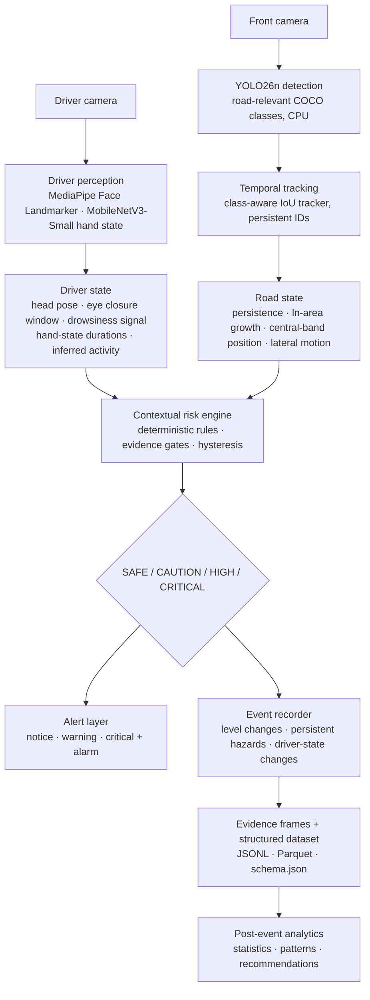

# Architecture

Status key: **[implemented]** exists and is tested · **[planned]** designed in the spec, not built yet.

## Pipeline



```text
camera (driver + front, recorded separately)     [implemented as recorded-video input; no live capture, no synchronized pair]
  → driver perception (DriverState)              [implemented; incl. hand-state classifier]
  → road perception (road objects)               [implemented: pretrained YOLO26n detections; road damage not built]
  → tracking (persistent IDs)                    [implemented: IoU tracker, image-space motion features]
  → temporal features (persistence, ln-area growth, central-band position, lateral motion)  [implemented inside the risk engine]
  → risk engine (SAFE/CAUTION/HIGH/CRITICAL)     [implemented: transparent rules, gates, hysteresis]
  → alert / alarm                                [implemented: app/alerts, console + optional terminal bell]
  → event recorder (frame or ±5 s clip evidence) [implemented: frame evidence default, clip mode available]
  → structured dataset                           [implemented: events.jsonl + events.parquet + schema.json]
  → post-event analytics                         [implemented: app/analytics; GPS hotspots only if real GPS exists (none in this dataset); optional LLM hook off by default]
```

Supporting infrastructure **[implemented]**: configuration (`app/config/settings.py`, `app/config/driver_config.py`), logging (`app/config/logging_config.py`), entry point (`app/main.py`), environment check (`scripts/check_env.py`), dataset audit and hand-label preview (`app/dataset_audit/`, `scripts/audit_dataset.py`, `scripts/preview_hand_dataset.py`), tests (`tests/`).

## Components

| Stage | Package | Responsibility | Status |
| --- | --- | --- | --- |
| Config / logging | `app/config` | Env-driven settings, root-relative paths, console + file logging | implemented |
| Dataset audit | `app/dataset_audit` + `scripts/audit_dataset.py` | Read-only scan of the external local dataset: finds camera folders at any depth, detects the folder layout (`original_plan` / `collected_2026_09`), counts per real class, image/video metadata, corrupt/empty/unsupported files, SHA-256 duplicates, manifest + report | implemented, run on the real dataset |
| Hand-label preview | `app/dataset_audit/hand_preview.py` + `scripts/preview_hand_dataset.py` | Deterministic, evenly spaced samples per hand-state class → contact sheet (EXIF applied for display only) + JSON manifest | implemented (tested on fixtures) |
| Hand-state classifier | `app/driver/hand_model.py` + `scripts/train_hand_model.py`, `scripts/evaluate_hand_model.py` | MobileNetV3-Small (ImageNet) with a 3-class head. Pad-to-square 224 px preprocessing, mild train-only augmentation, class-weighted CE, best checkpoint by validation macro-F1. `predict_hand_state()` with UNKNOWN below a 0.60 confidence threshold | implemented; trained on the real split; wired into `DriverPerceptionPipeline` via `TrainedHandStateProvider` |
| Hand-state dataset split | `app/driver/hand_dataset.py` + `scripts/prepare_hand_dataset.py` | 3-class discovery, SHA-256 duplicate exclusion, seeded image-level 70/15/15 split stratified by class + capture format (header size + EXIF; not a group ID), invariant checks, change-vs-previous-split record → `hand_{train,val,test}.json` + manifest + report; `load_training_image` applies EXIF at load time | implemented; run on the real dataset |
| Driver perception | `app/driver` | Face landmarks, head yaw/pitch/roll, eye openness, temporal eye closure, drowsiness score, manual-control state (hand classifier) with durations, inferred driver activity | implemented; run on one real drowsiness video |
| Road perception | `app/road` + `scripts/test_road_perception.py` | Pretrained YOLO26n (Ultralytics) detections filtered to road-relevant COCO classes → `Detection` / `RoadPerceptionResult`; image + sampled-video runners; dev-only annotation | implemented (run on real front-camera data); road-damage component planned |
| Tracking | `app/tracking` + `scripts/test_road_tracking.py` | Class-aware greedy IoU tracker: persistent IDs, miss handling, label-change history, image-space velocity and bbox-area growth | implemented (run on real videos); ln-area growth (approach proxy) computed in the risk engine; path overlap not built (no calibrated path model) |
| Risk engine | `app/risk` + `scripts/test_risk_engine.py` | Transparent rules over DriverState + tracked objects → raw/smoothed prototype score, level, hazard type, factors, reason | implemented (synthetic + real-data run); alerts in `app/alerts` |
| Alerts | `app/alerts` | AlertManager: engine level changes → NOTICE / WARNING / CRITICAL alerts, alarm on escalation into the engine's alarm level (`alarm_recommended`), console + terminal-bell sinks, replay from recorded events | implemented |
| Demo runner | `app/demo` + `scripts/run_demo.py` | One real video (front or driver) → existing pipeline → events, alerts, evidence, timeline.csv, risk_timeline.png, annotated_demo.mp4, demo_summary.json, final report | implemented (run on real videos) |
| Sensors | `app/sensors` | `video.py`: VideoReader, FrameClock (container timestamps → index/fps fallback), FrameSampler; shared by driver and road video runners. GPS | video: implemented; GPS interface + CSV log reader implemented (`app/sensors/gps.py`); no GPS hardware or real GPS log |
| Events | `app/events` + `scripts/record_events.py` | Event triggers with dedup/cooldown, provenance-labelled schema (60 fields), frame/clip evidence, JSONL + Parquet writers (real and synthetic kept apart); GPS interface in `app/sensors/gps.py` | implemented (run on real local data) |
| Synthetic scenarios | `app/simulation` + `scripts/generate_synthetic_scenarios.py` | 12 designed feature-level scenarios (constructed detections + scripted driver signals) run through the existing tracker / driver temporal logic / risk engine / event recorder; SYNTHETIC-only dataset `data/simulated/` (schema sim-1.0) with expected-vs-actual validation | implemented (1,441 rows) |
| Analytics | `app/analytics` + `scripts/generate_safety_report.py` | Post-event (offline): LOCAL_REAL event statistics, descriptive patterns, GPS hotspots only from real GPS (else an explicit "unavailable" message), deterministic recommendations, event entries, optional LLM summary hook (off by default); synthetic reported separately on request | implemented |
| Dashboard | `app/dashboard` | Live / recorded-video demo view | planned |

## Driver perception (`app/driver`)

```text
frame (BGR)
 → face provider            face.py        MediaPipeFaceProvider | NullFaceProvider → FaceResult
 → head pose                head_pose.py   solvePnP on 6 landmarks → yaw / pitch / roll
 → eye features             eyes.py        eye-aspect ratio per eye → openness, eyes_closed
     = DriverFrameObservation (per frame, no memory)
 → temporal eye closure     temporal.py    rolling window: closure ratio, closed duration, blinks, long closures
 → drowsiness               drowsiness.py  score ∈ [0, 1] + level UNKNOWN / LOW / HIGH / CRITICAL
 → hand-state provider      hand_state.py  TrainedHandStateProvider (mobilenet_v3_small, loaded once)
                                           | UnknownHandStateProvider → OBSERVED hand_state + confidence
 → manual-state durations   state_duration.py  current state, duration, transitions, longest per state
 → activity inference       pipeline.infer_activity  → INFERRED driver_activity + source + reason
     = DriverTemporalState
 → DriverState              models.py      observation + temporal + hand result + activity + observation_quality
```

Entry point: `DriverPerceptionPipeline(face_provider, config, hand_provider=None).process(frame, timestamp)`, plus `reset()` and `close()`.

Key rules:

- **Three layers.** `DriverFrameObservation` (one frame), `DriverTemporalState` (history), `DriverState` (final record). `pipeline.observe()` returns the per-frame layer alone.
- **Hand state is a plug-in.** The pipeline depends only on the `HandStateProvider` protocol (`predict(frame) -> HandStateResult`, `reset()`). `TrainedHandStateProvider` wraps `HandStateClassifier` from `hand_model.py` (same preprocessing as training, CPU); it is built once by the caller and passed in the constructor. It only runs on frames the caller processes, so video sampling applies to it too. If a provider raises, the result degrades to UNKNOWN.
- **Observed vs inferred.** `hand_state` (BOTH_HANDS / ONE_HAND / NO_HANDS / UNKNOWN) is what the classifier observed in one frame; it describes manual control, not a hand count and not phone use. `driver_activity` is inferred: `HANDS_OFF_WHEEL` only when NO_HANDS has been observed continuously for ≥ `NO_HANDS_INFERENCE_SECONDS` (2.0 s, prototype value); ONE_HAND and short NO_HANDS give `NORMAL`; UNKNOWN gives `UNKNOWN`. `PHONE` / `OTHER_MANUAL_DISTRACTION` appear only if another provider reports them. `activity_source` (`inferred_temporal` / `observed_provider` / `none`) and `activity_reason` record why.
- **UNKNOWN hand state.** It closes the current hand-state run, so the next ONE_HAND or NO_HANDS starts at 0 s (UNKNOWN never extends a previous state), but it does not reset the face / eye / drowsiness timeline.
- **Missing is not a state.** No face / invalid frame → all per-frame measurements are None. Missing frames are never counted as closed eyes, and a face lost for more than `MAX_GAP_SECONDS` breaks a closure run. UNKNOWN hand state gives `distraction_duration = None`, not 0.
- **Timestamps.** Float seconds on one clock per session (video time or `time.monotonic()`; `None` → monotonic). A backwards timestamp auto-resets temporal state and sets `timeline_reset = True`. Non-finite or non-numeric timestamps raise `ValueError` (caller bug).
- **Head-pose convention** (camera facing the driver, image not mirrored): yaw > 0 = face turned toward image right (driver's left); pitch > 0 = head down; roll > 0 = clockwise in the image. Generic face model + uncalibrated camera, so the angles are a relative signal, several degrees off in absolute terms.
- **Drowsiness is a prototype behavioural signal.** `score = max(current closure part, window part)`. A normal blink or one closed frame stays near 0. Sustained closure raises the score immediately. The window part only counts after `MIN_OBSERVED_SECONDS` of face time. All thresholds are in `app/config/driver_config.py` / `.env`; none are medically validated.
- **Face provider** = MediaPipe Tasks Face Landmarker (CPU, IMAGE mode, 1 face). It needs the `face_landmarker.task` model file in `models/face/` (not in git). Without it, `NullFaceProvider` keeps the pipeline structurally runnable and honestly reports `PROVIDER_UNAVAILABLE`.

## Road perception (`app/road`)

```text
frame (BGR) + timestamp
 → YoloRoadDetector.detect   detector.py   model loaded ONCE (+ one warm-up call); classes filtered in the model call
 → build_detections          detector.py   drop conf < threshold, keep allowed classes, clip boxes, sort by confidence
     = RoadPerceptionResult  models.py     timestamp, frame_index, image size, status, inference_ms, detections
         Detection                         class_name/id, category, confidence, bbox x1/y1/x2/y2 (+ center, width, height), source
```

- **Detection is not interpretation.** Nothing in `app/road` scores danger, distance, motion or risk. `category` (vehicle, two_wheeler, person, animal, traffic_control) is only a coarse "what" grouping.
- **Frames.** `detect()` takes BGR uint8 HxWx3 arrays. Invalid frames → `INVALID_FRAME` without calling the model; a model exception → `PROVIDER_ERROR`; zero detections is `OK`.
- **Video.** `runner.run_video` uses `app/sensors/video.py` like the driver runner: grab every frame (exact timestamps), decode and detect only frames on the `sample_fps` grid. Detections carry the frame timestamp and index so a tracker can be added next without changing this layer.
- **Device.** `DEVICE`/`ROAD_DEVICE` = auto → CUDA only if torch reports it, else CPU. CPU is the tested path.
- **Tracking** is a separate layer (`app/tracking`); detection results are passed to it unchanged.

## Tracking (`app/tracking`)

```text
RoadPerceptionResult.detections + timestamp
 → IoUTracker.update         tracker.py   1. end tracks unseen > max_missed_seconds
                                          2. greedy IoU matching: same class (IoU >= 0.3), then different class only if IoU >= 0.6
                                          3. unmatched detections -> new IDs (1, 2, 3, ...)
                                          4. unmatched tracks coast (active=False), end after max_missed_seconds / frames
     = list[TrackedObject]   models.py    track_id, class_name (majority), observed_class (latest, unmodified), class_history,
                                          class_changes, first/last seen, age, missed, persistence, detection_count, active,
                                          bbox, center, width/height, area, previous center/area,
                                          velocity x/y + speed (px/s), area_change_rate (px²/s), relative_area_change_rate (1/s)
```

- **Image space only.** No calibration, so there are no metres, km/h, distance or TTC. Area growth is a relative "getting bigger in the image" signal.
- **Rates** compare the current matched detection with the previous matched detection of the same track, divided by the real time between them. Sampling gaps and short misses are therefore handled. The values are raw (unsmoothed) and noisy frame to frame.
- **Labels are never rewritten.** `observed_class` is exactly what YOLO said. `class_name` is the most frequent observed class, and `class_history` / `class_changes` expose flicker. Two YOLO boxes of different classes on one object can create two parallel tracks; the tracking script reports these as overlapping tracks.
- **Deterministic**, with no model. It costs about 0.25 ms per frame against about 65 ms for YOLO. Backwards timestamps end all tracks (`timeline_resets`); call `reset()` between videos.
- **Config:** `app/config/tracking_config.py` (`TRACK_*` env vars).

## Risk engine (`app/risk`)

```text
RiskSnapshot(timestamp, tracks: list[TrackedObject], driver: DriverState | None, image_width, image_height)
 → TrackFeatureHistory      smoothing.py  per track, last 1 s: slope of ln(area) (growth /s), slope of x/width (lateral)
 → evaluate_track           rules.py      gates (persistence, detections, not coasting) -> persistence, centrality,
                                          approach, trajectory, image_size points; qualifies? else presence cap;
                                          x evidence quality (confidence, label changes)
 → driver_factors           rules.py      drowsiness HIGH/CRITICAL, HANDS_OFF_WHEEL, sustained head-away (ONE_HAND = 0)
 → combination              engine.py     multi-hazard bonus, caps, driver+road combination bonus, clamp 0-100
 → level + gates            rules.py      thresholds 20/45/70; HIGH needs 2 evidence groups; CRITICAL needs driver+moving hazard
                                          or a very strong road hazard
 → RiskHysteresis           smoothing.py  N consecutive observations to escalate, one level down at a time, score decay
     = RiskAssessment       models.py     risk_level, raw_risk_level, raw/smoothed score, hazard_type, primary_track_id,
                                          contributing_factors (sum == raw score), reason, evidence_quality, alarm_recommended
```

- **Decision logic only.** No YOLO, OpenCV, images or ML in `app/risk`. It is deterministic; `reset()` is called between sessions, and backwards time resets automatically.
- **Image-space road signals.** The "central band" is a stand-in for "ahead", not a calibrated path. No distance, speed or TTC is claimed.
- **Scores and levels.** `risk_score` = `smoothed_risk_score`, a prototype score, not a probability. Levels are decision-support states.

## Events (`app/events`)

```text
RiskAssessment + TrackedObjects + DriverState (+ frames for evidence, + GPSProvider)
 → EventRecorder.on_risk      RISK_ESCALATED / RISK_DEESCALATED on every level change;
                              PERSISTENT_HAZARD per (hazard type, track) after 2 s, 10 s cooldown
 → EventRecorder.on_driver    DRIVER_STATE_CHANGE (hand_state OBSERVED; activity / drowsiness INFERRED),
                              stable for 3 observations, UNKNOWN ignored, 5 s cooldown
 → EvidenceStore              frame mode: <run_id>/event_N/{metadata.json, front_frame.jpg, driver_frame.jpg}
                              clip mode: ring buffer 5 s before + 5 s after -> front.mp4 / driver.mp4
 → EventRecord                validated against schema.py (types, nullability, provenance rules)
 → EventDatasetWriter         events.jsonl (+ events.parquet with pyarrow) + schema.json; kind="real" or "synthetic"
```

- **Layer separation.** The recorder depends only on the structured outputs of the risk, tracking and driver layers, not on YOLO. OpenCV is imported only to write MP4 clips.
- **Provenance.** `data_source` is LOCAL_REAL / PUBLIC / SYNTHETIC / SYNTHETIC_COMBINATION. Real and synthetic records live in different dataset roots, and each writer refuses the other kind.
- **Field provenance.** Every field is tagged METADATA / OBSERVED / INFERRED in `schema.json`. Risk and hazard events are always `observation_type = INFERRED`.
- **GPS.** Values only come from a real `GPSProvider`; otherwise the fields are null / UNAVAILABLE. Coordinates are never invented.
- **Deterministic IDs.** Event IDs are `event_000001…` per run; evidence paths are relative (`<run_id>/<event_id>/…`).

## Synthetic scenarios (`app/simulation`)

```text
scenarios.py  ObjectStep (constructed box/label/confidence) + DriverStep (scripted head pose, eye openness, hand)
generator.py  -> IoUTracker -> ScriptedDriverPipeline (DriverPerceptionPipeline, camera replaced) -> RiskEngine
              -> EventRecorder(data_source=SYNTHETIC) -> row (validate_sim_row)
writer.py     data/simulated/{scenarios.jsonl, scenarios.parquet, schema.json, manifest.json} + report
```

- **Reuse, don't re-implement.** The generator only constructs inputs. Every derived value comes from the existing components with their default configuration.
- **Provenance.**
  - `data_source`, `observation_type`, `timestamp_source` and `gps_source` are all SYNTHETIC; `location_source` is SYNTHETIC_REFERENCE.
  - Field provenance is METADATA / SYNTHETIC_INPUT / ENGINE_ON_SYNTHETIC / VALIDATION.
  - The writer refuses non-SYNTHETIC rows and any path inside `data/events/`.
- **Parents.** Real LOCAL_REAL events are read-only references. They seed parameters, and their ids are kept.

## Interfaces

```python
driver_state = driver_pipeline.process(frame, timestamp)   # implemented
road_objects = road_detector.detect(frame, timestamp, frame_index)   # implemented
tracks = tracker.update(road_objects.detections, timestamp)   # implemented
risk = risk_engine.evaluate(RiskSnapshot(timestamp, tracks, driver_state, w, h))   # implemented
events = event_recorder.on_risk(risk, tracks, driver_state, frame_index, (w, h))   # implemented
```

## Design rules

- The real-time loop (perception → risk → alarm) never calls an LLM.
- Use pretrained detectors; train only small task-specific models.
- Each module is independently testable and exposes one clear interface.
- CPU fallback is always available; GPU (ROCm/CUDA via PyTorch) is optional.
