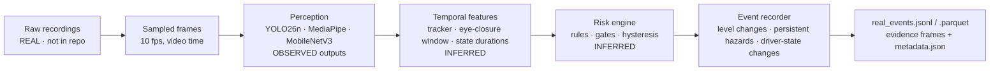

# Data documentation

This document explains what was physically collected, how it became a structured event dataset, and how to inspect every step. Three kinds of data are kept strictly apart:

- **OBSERVED/REAL:** captured by our cameras.
- **INFERRED/DERIVED:** computed from real observations.
- **SYNTHETIC:** constructed for controlled validation.

## 1. What was collected?

The raw dataset consists of camera recordings from two viewpoints.

**Driver-facing camera** (189 images, 10 videos):
- `both_hands_on_steering`: 30 images, 1 video;
- `one_hand_on_steering`: 97 images;
- `no_hands`: 62 images;
- `drowsy_driver`: 9 videos.

**Front-facing camera** (15 images, 26 videos):
- `dogs_on_road`: 3 videos;
- `pedestrains` (the folder name as recorded): 5 images, 6 videos;
- `roads`: 7 images, 3 videos;
- `vehicles`: 3 images, 14 videos.

Audit ([reports/dataset_audit.md](reports/dataset_audit.md)):

- **Files:** 240 in total; 204 readable JPEG images and 36 readable MP4 videos (≈131.7 s).
- **Quality:** 0 corrupt or unreadable, 0 empty.
- **Duplicates:** 1 exact-duplicate group (SHA-256), which is excluded from the hand-state split.

Folder names are how the recordings were organised. The pipeline does **not** treat them as ground-truth labels for road objects. Hand-state folders are the labels for the hand-state classifier.

## 2. Where and when?

- **When:** 26 Sep 2026. Recording file names span about 16:59–22:09 local time, in daylight, dusk and night. The files carry no other clock.
- **Where:** local roads and paths used by the team. Exact locations were **not recorded**, and **no GPS was collected**, so every event has `gps_lat = gps_lon = null` and `gps_source = "UNAVAILABLE"`.
- **Recording setup:** the front camera was a phone camera moving along the road (the mounting is not documented). The drowsy-driver videos were recorded in a **stationary, staged setup**, not in a moving vehicle. Driver and front recordings were made **separately and are not synchronized**.
- **Image frame names:** some hand-state images have names such as `Normal_Driving-vid_7-frame_0502.jpg` or `Using_Electronics_Items-vid_4-frame_1019.jpg`. This shows they are frames extracted from source videos. Those source videos are not part of the dataset, and this repository does not document their capture details.

## 3. With what sensors?

Phone cameras only:

| Stream | Formats seen in the audit |
| --- | --- |
| Front-camera videos | 1920×1080 at 42–60 fps (H.264) or 2160×3840 portrait at ~30 fps (HEVC) |
| Driver videos | 3840×2160 at ~60 fps (HEVC) |
| Images | JPEG, 848×480 up to 4608×2076 |

There was no CAN bus, IMU, GPS, radar or lidar.

## 4. How did observations become data?



**Run modes:**
- **Real road-only:** 14 front-camera videos sampled at 10 fps (515 frames, 50.1 s).
- **Real driver-only:** 3 drowsy-driver videos (168 driver observations, 16.5 s).
- One run, `local_real_run_01`, produced **66 events** in 16 of the 17 processed sessions.

**Row definition:** one row is **one event**, not one frame. It is written when:
- the risk level changes after hysteresis (`RISK_ESCALATED` / `RISK_DEESCALATED`);
- a qualifying hazard persists ≥ 2 s on the same track (`PERSISTENT_HAZARD`, 10 s cooldown);
- a driver state changes and holds for 3 observations (`DRIVER_STATE_CHANGE`, 5 s cooldown).

Without deduplication the same run would have produced 683 per-frame rows.

## 5. What is real, inferred and synthetic?

| Source | Real/Synthetic | Collection method | Processing |
| --- | --- | --- | --- |
| Front-camera videos/images | **REAL** (LOCAL_REAL) | phone camera on local roads | YOLO26n → IoU tracker → risk engine → events |
| Driver-camera videos | **REAL** (LOCAL_REAL) | phone camera, staged stationary setup | MediaPipe face + hand classifier → temporal driver state → risk engine → events |
| Hand-state images | **REAL** (as provided by the team) | frames organised into 3 hand-state folders | train/val/test split → fine-tuned MobileNetV3-Small |
| `data/sample/real_events.*` | **REAL-derived** (OBSERVED + INFERRED fields) | event recorder on the real runs | schema-validated, 60 fields |
| `data/synthetic/scenarios.*` | **SYNTHETIC** | constructed feature-level scenarios, seed 42 | existing tracker / driver logic / risk engine / recorder on constructed inputs |

**Field categories in the real event schema:**

| Field category | Meaning | Example |
| --- | --- | --- |
| METADATA | bookkeeping and provenance written by the recorder | `event_id`, `run_id`, `source_file`, `data_source`, `evidence_path` |
| OBSERVED | measured directly in a frame | `timestamp`, `hazard_class`, `hazard_confidence`, `bbox_area`, `driver_hand_state`, `face_status` |
| INFERRED | derived by the tracker or rules | `primary_track_id`, `box_growth_per_second`, `hazard_persistence`, `risk_level`, `smoothed_risk_score`, `drowsiness_level`, `risk_reason` |

The hand-state classifier's output (`driver_hand_state`) is treated as an observed per-frame signal in this project, as the schema documents. The **driver activity** built from it over time (`driver_activity`, e.g. `HANDS_OFF_WHEEL` after ≥ 2 s of `NO_HANDS`) is INFERRED.

**Record-level provenance:**

- `data_source`: `LOCAL_REAL` for every real row, and `SYNTHETIC` for every synthetic row.
- `observation_type`:
  - `INFERRED` for every risk and hazard event;
  - `OBSERVED` only for a change of the observed hand state (2 real events).
  - Synthetic rows use `SYNTHETIC`.
- Real events keep GPS null. Synthetic rows carry synthetic GPS near a generic reference point, labelled `gps_source = SYNTHETIC` and `location_source = SYNTHETIC_REFERENCE`, and that GPS never appears in real data.

## 6. How many observations and events?

| | Count |
| --- | ---: |
| Raw files audited | 240 (204 images, 36 videos) |
| Real events | 66 (front camera 54, driver camera 12) |
| Event types | 32 RISK_ESCALATED · 18 RISK_DEESCALATED · 9 PERSISTENT_HAZARD · 7 DRIVER_STATE_CHANGE |
| Risk level on level-carrying events | SAFE 9 · CAUTION 34 · HIGH 16 · CRITICAL 0 |
| Events with evidence frames | 48 (96 files: frame + metadata.json) |
| Synthetic rows | 1,441 (separate dataset) |

## 7. What evidence is stored?

For escalations, persistent hazards and driver-state changes, the recorder saves:

- one downscaled JPEG per camera at the event time (`front_frame.jpg` or `driver_frame.jpg`);
- a `metadata.json` holding the full event record and the frame timestamp.

Paths in the event rows are **relative** to the evidence root: `local_real_run_01/event_000012/front_frame.jpg`. De-escalations store no evidence by configuration. A clip mode (5 s before + 5 s after) exists but was not used for this run.

**Public subset:** this repository includes the unaltered evidence for three real events in [`data/sample/evidence/`](data/sample/evidence/):

- `event_000001` and `event_000005` (a dog at night);
- `event_000012` (a pedestrian on a crossing).

The other evidence frames are withheld from the public repository because they show:
- **driver frames:** the clearly identifiable face of a team member;
- **road frames:** readable number plates of third-party vehicles, or bystanders.

[`results/images/`](results/images/) adds one road frame with its number plate blurred. It is a derived copy, not original evidence.

## 8. File formats

| File | Purpose |
| --- | --- |
| `real_events.jsonl` | One JSON object per line, all 60 fields, easiest to read or grep |
| `real_events.parquet` | Same rows, typed columnar storage (pyarrow), for pandas / DuckDB / Spark |
| `real_events_sample.json` | 10 representative real events, pretty-printed |
| `data/schema/real_event_schema.json` | Every field: type, nullability, provenance, description, allowed values |
| `data/schema/synthetic_schema.json` | The synthetic schema (`sim-1.0`) with field provenance and the name mapping |
| `evidence/<run>/<event>/metadata.json` | The event record next to its evidence frame(s) |
| `data/synthetic/manifest.json` | Seed, counts, parents, provenance policy and expected-vs-actual results of the synthetic run |

## 9. What did AI generate or infer?

- **AI models inferred** per-frame outputs: detector boxes, labels and confidences (YOLO26n); face landmarks (MediaPipe); hand-state class and confidence (MobileNetV3-Small).
- **Deterministic code inferred** everything temporal or contextual:
  - tracks;
  - persistence;
  - box growth;
  - eye-closure metrics and drowsiness score;
  - driver activity;
  - risk score and level;
  - hazard type;
  - reason text;
  - alarm recommendation;
  - event type.
- **No LLM generated any value in the datasets.** The post-event summary hook is deterministic by default and was not run with an LLM.
- **Synthetic rows were generated by code** from designed scenario scripts. Some parameters are seeded from the value ranges of 17 real "parent" events, referenced by id.

## 10. How can a reviewer inspect it?

```python
import pandas as pd, json
df = pd.read_parquet("data/sample/real_events.parquet")          # 66 rows × 60 columns
df.groupby(["event_type", "risk_level"], dropna=False).size()
df[df.event_id == "event_000012"].T                              # one event, all fields
json.load(open("data/schema/real_event_schema.json"))["fields"][:3]
syn = pd.read_parquet("data/synthetic/scenarios.parquet")         # SYNTHETIC, never mixed
syn.data_source.unique()                                         # ['SYNTHETIC']
```

Then open `data/sample/evidence/local_real_run_01/event_000012/front_frame.jpg` and its `metadata.json`. The test `tests/test_public_data.py` checks that the sample rows parse, match the schema, and are all `LOCAL_REAL`.
