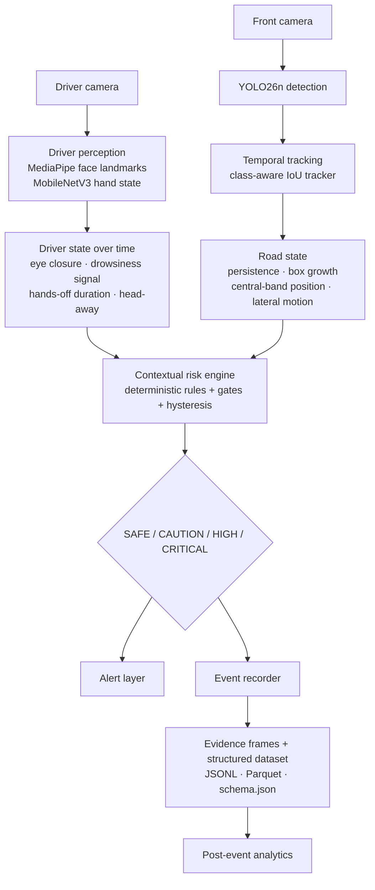
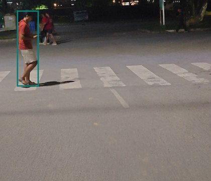
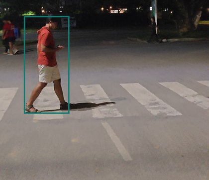
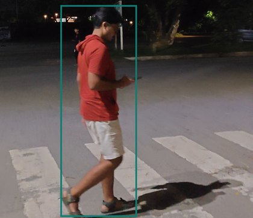
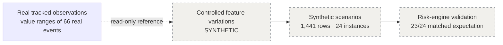
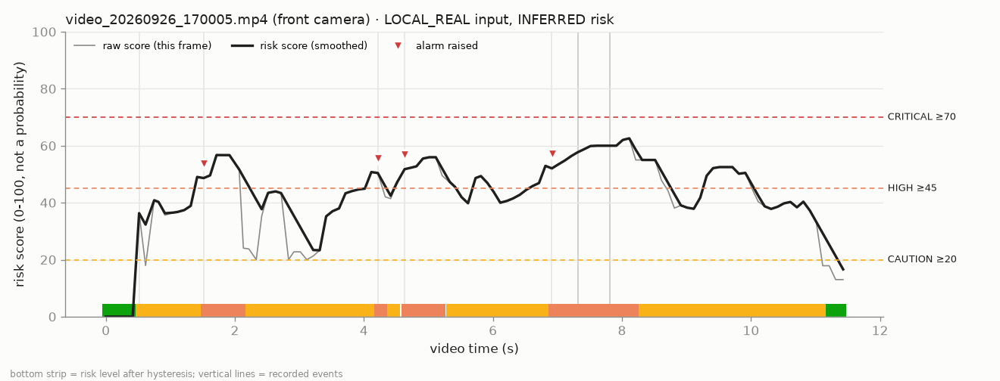

# Physical AI Driving Safety System

**From physical observation to contextual risk, intervention, and traceable safety data.**

This is an early-stage Physical AI prototype built for the Granica × IIT Guwahati *"Bring the Physical World to AI"* challenge. It watches the road (front camera) and the driver (driver camera). It follows what changes over time, combines road and driver state into a **rule-based contextual risk level**, raises an alert when that level rises, and records every meaningful situation as a **structured, evidence-backed safety event**.

> **What this is not:** a collision predictor, an autonomous-driving system, a distance/speed/TTC estimator, or a medical drowsiness detector. It is a decision-support and data-collection prototype, evaluated on a small set of locally recorded clips. See [LIMITATIONS.md](LIMITATIONS.md).

| Headline (real data) | Value |
| --- | --- |
| Raw files collected and audited | **240** (204 JPEG images + 36 MP4 videos, 0 corrupt), ≈ **131.7 s** of video |
| Real safety events recorded | **66** from **16** recordings, 60-field schema, JSONL + Parquet |
| Events with saved evidence frames | **48** |
| Risk levels on real events | 9 SAFE · 34 CAUTION · 16 HIGH · 0 CRITICAL |
| Engine alarm recommendations | **16** |
| Synthetic validation (kept separate) | 1,441 feature-level rows · 24 scenario instances · 23/24 matched expectation |

---

## 1. The problem

A driver's risk depends on how a situation **changes**. Seeing a single frame is not enough.

A pedestrian at the roadside is normal. The same pedestrian moving into the area ahead, getting bigger in the image frame after frame, while the driver's eyes are closing, is a different situation.

A detector answers *"what is visible?"*. The questions that matter to a driver are:

- **What is changing?**
- **Does it matter in this context?**
- **Does the driver need to act now?**

## 2. Why this is Physical AI

The system starts from **physical observations**: camera frames of real roads and a real driver. It turns them into **decisions** (a risk level and an alert) and into **data** (a traceable event with evidence and provenance). Every step from photons to record is inspectable.

- **Physical world:** real front-camera and driver-camera recordings, collected locally.
- **Perception:** pretrained and fine-tuned models extract objects, face landmarks and hand state per frame.
- **Temporal reasoning:** tracking, persistence, image-space approach and sustained driver state.
- **Decision:** a deterministic, explainable, rule-based risk engine produces SAFE / CAUTION / HIGH / CRITICAL.
- **Intervention:** an alert layer turns level changes into warnings.
- **Data:** an event recorder writes structured, schema-validated events with evidence frames and provenance labels.

## 3. What we built

| Layer | Module | What it does |
| --- | --- | --- |
| Dataset audit | `app/dataset_audit` | Read-only audit of the raw recordings: counts, formats, durations, corrupt files, duplicates |
| Driver perception | `app/driver` | MediaPipe face landmarks → head pose, eye openness, blink/closure tracking, prototype drowsiness score; MobileNetV3-Small hand-state classifier; temporal driver state |
| Road perception | `app/road` | Pretrained YOLO26n on road-relevant COCO classes (CPU) |
| Tracking | `app/tracking` | Class-aware IoU tracker. Persistent IDs, lifetime, detection counts, class history, pixel velocity, box growth |
| Risk engine | `app/risk` | Deterministic rule-based fusion of road and driver evidence, with gates and hysteresis. Produces an explained reason |
| Alerts | `app/alerts` | Level changes → notice / warning / critical alert (console + optional terminal bell) |
| Events | `app/events` | Event triggers, 60-field schema, evidence frames, JSONL + Parquet writers, provenance labels |
| Synthetic validation | `app/simulation` | Feature-level SYNTHETIC scenarios that stress-test the risk engine (separate dataset) |
| Post-event analytics | `app/analytics` | Offline statistics, repeated patterns, deterministic review recommendations |
| Demo runner | `app/demo`, `scripts/run_demo.py` | One real video → full pipeline → events, alerts, evidence, timeline, plots |

## 4. How the system works



In the current **real** dataset the two cameras were **not recorded together**. Real events are therefore road-only or driver-only, and the combined driver + road path is exercised only with labelled synthetic input (see §10).

## 5. What data we physically collected

The raw dataset was recorded by the team on **2026-09-26** (per file names: about 16:59–22:09 local time) with phone cameras. It is **not** included in this repository; only derived events and a few evidence frames are. The latest audit ([reports/dataset_audit.md](reports/dataset_audit.md)) found:

| Camera | Folder | Images | Videos |
| --- | --- | ---: | ---: |
| Driver | `both_hands_on_steering` | 30 | 1 |
| Driver | `one_hand_on_steering` | 97 | 0 |
| Driver | `no_hands` | 62 | 0 |
| Driver | `drowsy_driver` | 0 | 9 |
| Front | `dogs_on_road` | 0 | 3 |
| Front | `pedestrains` (folder name as recorded) | 5 | 6 |
| Front | `roads` | 7 | 3 |
| Front | `vehicles` | 3 | 14 |
| **Total** | **240 files, 0 corrupt** | **204** | **36 (≈131.7 s)** |

**Driver camera:** 189 images and 10 videos. **Front camera:** 15 images and 26 videos. Details: [DATA_DOCUMENTATION.md](DATA_DOCUMENTATION.md).

## 6. What the AI models observe

- **YOLO26n** (pretrained, not fine-tuned): people, bicycles, cars, motorcycles, trucks, buses, dogs and other road-relevant COCO classes, per sampled frame.
- **MediaPipe Face Landmarker:** face landmarks, from which the code computes head yaw/pitch and eye openness.
- **MobileNetV3-Small** (ImageNet-pretrained, fine-tuned by the team): three hand states, `both_hands_on_steering`, `one_hand_on_steering` and `no_hands`. Below a 0.60 confidence threshold it reports `UNKNOWN`.

The models only say **what is present in one frame**. Everything temporal and contextual is computed by deterministic code.

## 7. How temporal reasoning changes the system

The same detection means different things over time. This is one real clip (`video_20260926_210536`, LOCAL_REAL):

| t = 0.5 s — detected | t = 1.5 s — persists / grows | t = 2.9 s — risk rises |
| --- | --- | --- |
|  |  |  |
| SAFE | CAUTION | HIGH |

The tracker keeps the pedestrian as one object (track ID 1 for the whole 3.3 s at 10 fps). The risk engine sees:

- persistence;
- a position in the central image band;
- a growing box (image-space approach proxy);
- lateral motion.

At 2.7 s the recorder logs a `PERSISTENT_HAZARD` event (rule-based score 47.1), and at 2.9 s the level escalates to HIGH.

Temporal signals used:

- **Road:** object persistence and detection count; slope of ln(box area) over ~1 s (an image-space approach proxy, **not** distance or speed); horizontal motion toward the central band.
- **Driver:** rolling eye-closure ratio and current closure duration; NO_HANDS sustained ≥ 2 s before `HANDS_OFF_WHEEL` is inferred; head turned away ≥ 1 s.
- **Stability:** hysteresis. Entering HIGH needs 2 consecutive observations, and levels step down one at a time.

## 8. How alerts are generated

The alert layer (`app/alerts`) adds **no risk logic**. It maps the risk engine's level changes to alerts and quotes the engine's own `risk_reason`:

| Level | Alert |
| --- | --- |
| SAFE | none |
| CAUTION | visual/log notice |
| HIGH | "WARNING: ROAD HAZARD" (or "WARNING: DRIVER STATE" for a driver-only hazard) + audible alarm |
| CRITICAL | "CRITICAL: IMMEDIATE ATTENTION REQUIRED" + strong audible alarm |

Example console output from the real front-camera demo:

```text
[00:01.5] HIGH — pedestrian in or moving toward the central road region
          why: Persistent person #2 (observed 1.5 s, 16 detections): image-space box area growing 21%/s, …
[00:01.5] ALARM — WARNING: ROAD HAZARD
```

## 9. How physical observations become structured events

The recorder writes an event only when something meaningful happens, not every frame:

- `RISK_ESCALATED` / `RISK_DEESCALATED`: every level change.
- `PERSISTENT_HAZARD`: the same hazard and track for ≥ 2 s, with a 10 s cooldown.
- `DRIVER_STATE_CHANGE`: a hand / activity / drowsiness change held for 3 observations.

Each event is one row with 60 fields: provenance labels, timestamp, risk level and scores, hazard type, detector label, track id, image-space box and motion, driver state, the engine's reason and factors, and relative paths to evidence frames. Schema: [DATA_SCHEMA.md](DATA_SCHEMA.md).


A sample real event, abbreviated from [`data/sample/real_events_sample.json`](data/sample/real_events_sample.json):

```json
{"event_id": "event_000012", "event_type": "PERSISTENT_HAZARD", "data_source": "LOCAL_REAL",
 "observation_type": "INFERRED", "camera": "front", "timestamp": 2.70, "risk_level": "CAUTION",
 "smoothed_risk_score": 47.107, "hazard_type": "PEDESTRIAN_CONFLICT", "hazard_class": "person",
 "primary_track_id": 1, "hazard_persistence": 2.0, "gps_source": "UNAVAILABLE",
 "evidence_path": "local_real_run_01/event_000012",
 "risk_reason": "Persistent person #1 (observed 2.7 s, 28 detections): image-space box area growing 111%/s, in the central image band."}
```

The evidence for this event is in [`data/sample/evidence/local_real_run_01/event_000012/`](data/sample/evidence/local_real_run_01/event_000012/).

## 10. Real vs inferred vs synthetic data

| Category | What it is | Examples | Where |
| --- | --- | --- | --- |
| **OBSERVED / REAL** | Captured from our local recordings | camera frames, timestamps, frame/video metadata, detector boxes, labels and confidences, face landmarks, hand-classifier output, evidence frames | `data/sample/`, evidence frames |
| **INFERRED / DERIVED** | Computed from real observations | tracks, persistence, box growth (approach proxy), central-band relations, head pose, eye-closure metrics, drowsiness score, driver activity, risk score and level, hazard type, alarm recommendation, event type | same event rows, labelled per field |
| **SYNTHETIC** | Constructed feature-level scenarios | 1,441 rows, 24 instances, seed 42 | `data/synthetic/` only |

- **Field-level labels:** every field in the real schema is tagged `METADATA`, `OBSERVED` or `INFERRED`.
- **Record-level labels:** every record carries `data_source` (`LOCAL_REAL`) and `observation_type`.
- **Synthetic rows:** they carry `data_source = observation_type = SYNTHETIC`, and their GPS and timestamps are also marked SYNTHETIC.
- **Separation:** the writers refuse to mix real and synthetic records.



Synthetic scenarios were built **after** the real perception/event pipeline existed. They are controlled stress tests of the rule-based risk engine. They are **not** evidence that the physical system works on real roads.

## 11. AI usage: inside the system and during development

### AI inside the system

| Component | Type | Role |
| --- | --- | --- |
| YOLO26n | pretrained deep detector (not fine-tuned) | front-camera road-object detection |
| MediaPipe Face Landmarker | pretrained landmark model | face landmarks → head pose, eye openness |
| MobileNetV3-Small | ImageNet-pretrained CNN, **fine-tuned by the team** | 3-class driver hand state |
| Tracker | **deterministic** (class-aware IoU matching) | identity, persistence, velocity, box growth |
| Risk engine | **deterministic rules** (not an LLM, not a learned collision predictor) | contextual risk level + reason |
| Post-event LLM hook | optional, **off by default** | `generate_post_event_summary()` can rephrase the deterministic summary if `SAFETY_REPORT_LLM=anthropic` plus a model and API key are set. It was **not used** for any report in this repository, and it is not part of the real-time loop |

### AI-assisted development

The team used AI coding assistants (including Claude) as an **engineering copilot** during the build. They were used to help:

- structure the architecture;
- write and debug Python modules and tests;
- reason about model integration;
- design the event schema and data lineage;
- inspect logs and diagnose errors;
- identify edge cases and limitations;
- draft documentation and the presentation structure;
- package this repository.

**Human responsibilities** remained with the team:

- project direction;
- physical data collection and dataset organisation;
- model selection and architecture decisions;
- thresholds;
- validation and interpreting failures;
- deciding what can and cannot be claimed;
- final integration and evaluation.

## 12. Real results

Details and caveats: [RESULTS.md](RESULTS.md).

- **66 real events** from 16 recordings (54 front camera, 12 driver camera):
  - 32 escalations, 18 de-escalations, 9 persistent hazards, 7 driver-state changes;
  - by level: SAFE 9, CAUTION 34, HIGH 16, CRITICAL 0;
  - hazard types: pedestrian 28, approaching vehicle 19, drowsiness 4, animal 2, road user present 2.
- **Why no real CRITICAL:** CRITICAL is gated on a driver factor coinciding with a moving road hazard, or on a very strong road hazard. No synchronized driver + road recording exists.
- **Tracking** (14 front videos at 10 fps): 312 tracks, 182 with ≥ 2 detections, longest 5.6 s. One vehicle grew about 13× in image area over 3.5 s. 10 fps kept identities more stable than 5 fps.
- **Hand-state classifier:** accuracy / macro-F1 1.0 on a 27-image test split (the rebuilt class + capture-format split: 131 train / 30 val / 27 test). This result is indicative only, because the test set is small and capture/setup differences and near-duplicate structure limit claims of generalization.
- **Demo run** (`video_20260926_170005`, 11.5 s): 115 frames, 613 detections, 148 tracks, 12 events, 5 escalation alerts, 4 alarms.



## 13. Synthetic validation

- **What:** 12 designed scenario types × 2 variants at 10 Hz, seed 42, run through the **existing, unmodified** tracker, driver temporal logic, risk engine and event recorder.
- **Result:** 23 of 24 instances matched the qualitative expectation written before the run.
- **The mismatch:** `escalating_hazard__v02`. Its raw level reached HIGH only on the final step, and the hysteresis needs 2 consecutive HIGH observations. It is reported, not "fixed".
- **Details:** [reports/synthetic_scenario_report.md](reports/synthetic_scenario_report.md) and [`data/synthetic/`](data/synthetic/).

## 14. Known limitations

Key points; the full list is in [LIMITATIONS.md](LIMITATIONS.md):

- **Small real dataset.** There is no ground-truth collision or near-miss label.
- **Image-space only.** No calibrated distance, speed or TTC. Camera motion can look like approach.
- **No synchronized driver + front recording** and **no real GPS** in the current run.
- **Hand-state classifier limits:** there is a capture-setup domain shift, and no person/session-grouped split was possible. One real `NO_HANDS` event is a known misclassification.
- **Errors propagate.** Detector errors (e.g. a black dog at night labelled "person") flow into tracks, risk and events.
- **Drowsiness score is a prototype eye-closure signal**, not medically validated.

## 15. Repository structure

```text
README.md  ARCHITECTURE.md  DATA_DOCUMENTATION.md  DATA_SCHEMA.md  RESULTS.md
LIMITATIONS.md  DEMO.md  CONTRIBUTING.md  LICENSE  DATASET.md  physical_ai_driving_safety_plan.md
requirements.txt  requirements-nodeps.txt  pytest.ini  .env.example
app/            source: dataset_audit, driver, road, tracking, risk, alerts, events, simulation, analytics, demo
scripts/        command-line entry points (audit, train/evaluate, record events, demo, reports)
tests/          pytest suite
data/sample/    REAL events (JSONL, Parquet, sample JSON) + selected evidence frames
data/schema/    real_event_schema.json, synthetic_schema.json
data/synthetic/ SYNTHETIC scenario rows (JSONL, Parquet) + manifest
docs/           architecture, data lineage, methodology notes
results/        images/ (real evidence, timeline frames), plots/ (risk timelines, tracking, confusion matrix)
reports/        generated reports from the real runs
```

## 16. Reproduction

```bash
python -m venv .venv && . .venv/bin/activate          # Windows: .venv\Scripts\activate
pip install -r requirements.txt
pip install --no-deps -r requirements-nodeps.txt      # ultralytics (avoids an OpenCV conflict)
cp .env.example .env                                  # set DATASET_ROOT, FACE_MODEL_PATH, HAND_MODEL_PATH

python -m pytest -q                                   # tests (model/dataset-dependent tests skip without them)
python scripts/generate_synthetic_scenarios.py        # synthetic scenarios (no models or data needed)
python scripts/generate_safety_report.py --events data/sample/real_events.jsonl --no-system-status
```

With the raw dataset (not public) and the models:

```bash
python scripts/audit_dataset.py --root "<DATASET_ROOT>"
python scripts/record_events.py --front-source "<DATASET_ROOT>/frontcamera-…/frontcamera" --driver-source "<DATASET_ROOT>/drivercamera-…/drivercamera/drowsy_driver"
python scripts/run_demo.py --video "<DATASET_ROOT>/frontcamera-…/frontcamera/vehicles/video_20260926_170005.mp4" --output-dir outputs/demo --fps 10 --device auto
```

The model files are not in the repository:

- **YOLO26n** is downloaded automatically.
- **MediaPipe face landmarker:** download it as described in `app/driver/face.py`.
- **Hand-state checkpoint:** train it with `scripts/train_hand_model.py`.

## 17. Demo

See [DEMO.md](DEMO.md) for the 3-minute demo flow, the real demo outputs and the demo video's status.

## 18. Documentation

| Document | Contents |
| --- | --- |
| [ARCHITECTURE.md](ARCHITECTURE.md) | Components, interfaces, design rules |
| [DATA_DOCUMENTATION.md](DATA_DOCUMENTATION.md) | What was collected, how, provenance, how to inspect |
| [DATA_SCHEMA.md](DATA_SCHEMA.md) | Human-readable real and synthetic schemas |
| [RESULTS.md](RESULTS.md) | Measured results with caveats |
| [LIMITATIONS.md](LIMITATIONS.md) | Engineering limitations |
| [DEMO.md](DEMO.md) | Demo flow and outputs |
| [DATASET.md](DATASET.md) | Raw dataset layout and hand-state split |
| [docs/](docs/) | Architecture diagram, data lineage, methodology |
| [reports/](reports/) | Generated reports from the real runs |
