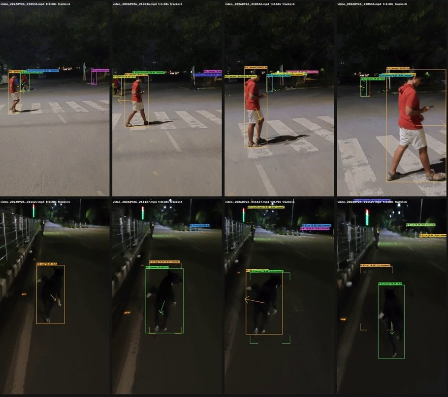

# Results

All numbers come from the runs documented in [`reports/`](reports/). They describe how this prototype behaved on a small, locally recorded dataset. They are **not** accuracy, safety or generalization claims. There are no ground-truth labels for collisions, near misses, object boxes or tracks.

## 1. Dataset (raw recordings; audit)

| Metric | Value |
| --- | ---: |
| Files | 240 |
| Readable JPEG images | 204 |
| Readable MP4 videos | 36 |
| Corrupt / unreadable | 0 |
| Real video duration | ≈ 131.7 s (container frame count ÷ fps) |
| Driver camera | 189 images + 10 videos |
| Front camera | 15 images + 26 videos |
| Exact-duplicate groups | 1 (excluded from the hand-state split) |

Source: [reports/dataset_audit.md](reports/dataset_audit.md).

## 2. Event data (real)

| Metric | Value |
| --- | ---: |
| Real events | 66 (`data_source = LOCAL_REAL`) |
| Recordings with events | 16 (of 17 processed: 14 front, 3 driver) |
| Schema | 60 fields, version 1.0 |
| Storage | JSONL + Parquet + schema.json |
| Events with evidence frames | 48 (96 files: frame + metadata) |
| By camera | front 54 · driver 12 |
| By type | RISK_ESCALATED 32 · RISK_DEESCALATED 18 · PERSISTENT_HAZARD 9 · DRIVER_STATE_CHANGE 7 |
| Observation type | INFERRED 64 · OBSERVED 2 (hand-state changes) |
| GPS | unavailable in every event, never invented |

Source: [reports/event_dataset.md](reports/event_dataset.md), [reports/safety_summary.md](reports/safety_summary.md), [`data/sample/`](data/sample/).

## 3. Real risk

| Level (on level-carrying events) | Events |
| --- | ---: |
| SAFE | 9 |
| CAUTION | 34 |
| HIGH | 16 |
| CRITICAL | 0 |
| no level (driver-state changes) | 7 |

- **Transitions:** SAFE→CAUTION 21, CAUTION→HIGH 11, HIGH→CAUTION 9, CAUTION→SAFE 9.
- **Alarm recommendations** (engine, level ≥ HIGH): **16** events.
- **Rule-based risk score** (smoothed, 0–100, not a probability): mean 38.6, max 60.0, over 59 events.
- **Elevated-risk episodes:** 21. Nine returned to SAFE within the clip (median 0.8 s, max 10.7 s); 12 were still elevated when the clip ended.

**Why there is no real CRITICAL event:**
- The engine allows CRITICAL only when a driver factor coincides with a moving road hazard, or for a very strong road hazard with both motion and position evidence.
- The real driver and front cameras were **not synchronized**, so real events are road-only or driver-only.
- A single driver factor cannot reach HIGH on its own: the gate needs two independent evidence groups.
- Driver-only real risk events therefore stay at CAUTION.

## 4. Real hazards

| Hazard type | Events |
| --- | ---: |
| Pedestrian conflict (`PEDESTRIAN_CONFLICT`) | 28 |
| Approaching vehicle (`APPROACHING_VEHICLE`, image-space growth) | 19 |
| Driver drowsiness (`DRIVER_DROWSINESS`) | 4 |
| Animal (`ANIMAL_HAZARD`) | 2 |
| Road user present, no approach evidence (`ROAD_USER_PRESENT`) | 2 |
| None (level returned to SAFE) | 4 |
| no hazard field (driver-state changes) | 7 |

- **Persistent hazards:** 9 in total, 5 approaching-vehicle and 4 pedestrian (5 at HIGH, 4 at CAUTION).
- **Driver-state changes:** drowsiness HIGH→CRITICAL ×3, CRITICAL→HIGH ×2, hand ONE_HAND→NO_HANDS ×1, NO_HANDS→ONE_HAND ×1. The ONE_HAND→NO_HANDS event (`event_000056`) is a known classifier error: a hand is visible on the wheel.

## 5. Model results

### Hand-state classifier (MobileNetV3-Small, ImageNet-pretrained, fine-tuned)

| Metric (test split, 27 images) | Value |
| --- | ---: |
| Accuracy | 1.0 |
| Macro precision / recall / F1 | 1.0 / 1.0 / 1.0 |
| Per class (test samples) | both hands 4 · one hand 14 · no hands 9 |

**Setup:**
- 188 unique usable images after duplicate removal.
- Stratified by class and capture format (131 / 30 / 27), seed 42, image-level.
- Checkpoint selected on validation macro-F1.

**Caveat:** this result is indicative only, because the test set is small and capture/setup differences and near-duplicate structure limit claims of generalization.
- **Near-duplicate frames:** many images are consecutive frames of the same source clip, so similar frames can fall on both sides of the split.
- **No grouped split:** a person/session-grouped split was not possible.
- **Domain shift:** on the real drowsy-driver video (a different, staged setup) the classifier was visibly unreliable. See [reports/driver_camera_domain_comparison.md](reports/driver_camera_domain_comparison.md).

Sources: [reports/hand_test_report.md](reports/hand_test_report.md), [reports/hand_dataset_split.md](reports/hand_dataset_split.md), [results/plots/hand_confusion_matrix.png](results/plots/hand_confusion_matrix.png).

### Road detector (YOLO26n, COCO-pretrained, not fine-tuned; CPU)

- **Detection-only run:** 15 images + 10 videos, 129 frames, **365 detections**:
  - person 226, car 53, bicycle 28, motorcycle 27, truck 17, dog 10, traffic light 2, cat 1, bus 1;
  - mean CPU inference about 69 ms per frame.
- **Failure modes seen:**
  - a black dog at night labelled "person";
  - a scooter missed under headlight glare;
  - close vehicles getting double labels (car and bus);
  - distant small objects missed.

Source: [reports/road_perception_real_data.md](reports/road_perception_real_data.md).

## 6. Tracking (class-aware IoU tracker, 14 front videos, 10 fps)

| Metric | Value |
| --- | ---: |
| Frames processed | 515 |
| Detections | 1,616 |
| Tracks | **312** |
| Tracks with ≥ 2 detections | **182** (58 %) |
| Longest track | **5.6 s** (57 detections) |
| Largest image-area growth examples | parked car approached ×13.5 over 3.5 s; pedestrian ×13.9 over 3.3 s |

**5 fps vs 10 fps:** at 5 fps, 125 of 269 tracks (46 %) had ≥ 2 detections. A fast-growing pedestrian lost its identity between samples. At 10 fps the same pedestrian kept one ID for the whole 3.3 s, so 10 fps is the tracking default.

Source: [reports/tracking_real_data.md](reports/tracking_real_data.md).

## 7. Integrated demo run (real front-camera video)

Run on `vehicles/video_20260926_170005.mp4` (11.5 s):

| Metric | Value |
| --- | ---: |
| Frames processed | 115 (10 fps) |
| Detections / tracks | 613 / 148 |
| Frames per level | SAFE 8 · CAUTION 77 · HIGH 30 |
| Events | 12 (5 escalations, 5 de-escalations, 2 persistent hazards) |
| Alerts | 1 notice, 4 "WARNING: ROAD HAZARD" (4 alarms) |

One of the four warnings came from a bicycle track only 0.7 s old, with an extreme growth estimate. See [LIMITATIONS.md](LIMITATIONS.md). Source: [reports/final_demo_report.md](reports/final_demo_report.md).

## 8. Synthetic validation (SYNTHETIC; kept separate)

| Metric | Value |
| --- | ---: |
| Rows | 1,441 (10 Hz steps) |
| Scenario instances | 24 (12 types × 2 variants, seed 42) |
| Matched the qualitative expectation written before the run | 23 / 24 |
| Documented mismatch | `escalating_hazard__v02`: the raw level reached HIGH only on the final step. Hysteresis needs 2 consecutive HIGH observations, so the level stayed CAUTION |
| Real parent events used as value references | 17 |

These rows exercise the rule-based engine on constructed inputs. They are **not** real observations and say nothing about real-world performance. Sources: [reports/synthetic_scenario_report.md](reports/synthetic_scenario_report.md), [`data/synthetic/manifest.json`](data/synthetic/manifest.json).

## 9. Tests

Run on 2026-09-27 with `python -m pytest -q` (Python 3.13, CPU):

| Environment | Result |
| --- | --- |
| Clean checkout of this repository (no raw dataset, no model files) | **430 passed, 16 skipped**: dataset-, model- and real-event-dependent tests skip |
| Same checkout + raw dataset, YOLO26n weights, MediaPipe face model and hand-state checkpoint | **441 passed, 5 skipped**: the remaining skips need the working project's local `data/events/`, `data/simulated/` or `data/processed/` files |

`tests/test_public_data.py` checks:
- the published sample parses;
- it conforms to the schema;
- it matches the Parquet file;
- the evidence links resolve;
- synthetic rows are labelled and separate;
- markdown links resolve;
- no secrets or private paths are present.
