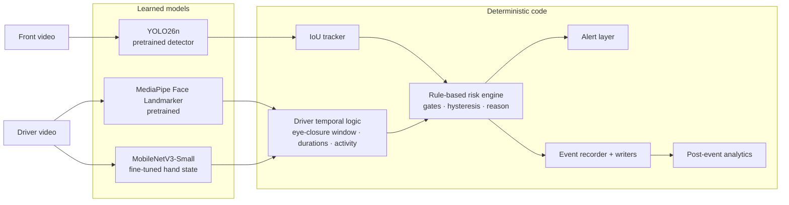

# System overview

- **Real-time loop:** perception → tracking → risk → alert. It contains **no LLM**.
- **Learned models** answer only per-frame questions: what objects are present, where the face landmarks are, and what hand state is visible.
- **Deterministic code** computes everything that depends on time or context: identity, persistence, image-space approach, sustained driver states, the risk level, the reason text, the alert and the event record.
- **Recorded video only:** the system runs on recorded video (offline replay at a sampled 10 fps, CPU). Driver and front videos run as **separate** sessions, because the real recordings are not synchronized.

Module details and interfaces: [ARCHITECTURE.md](../../ARCHITECTURE.md).
