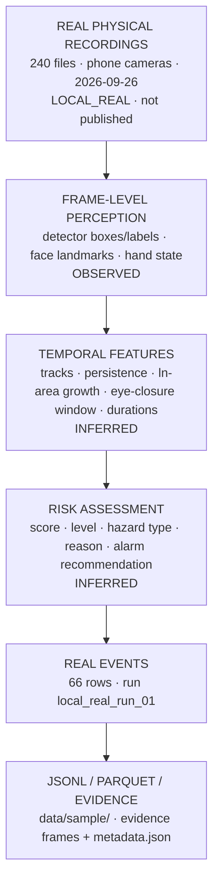
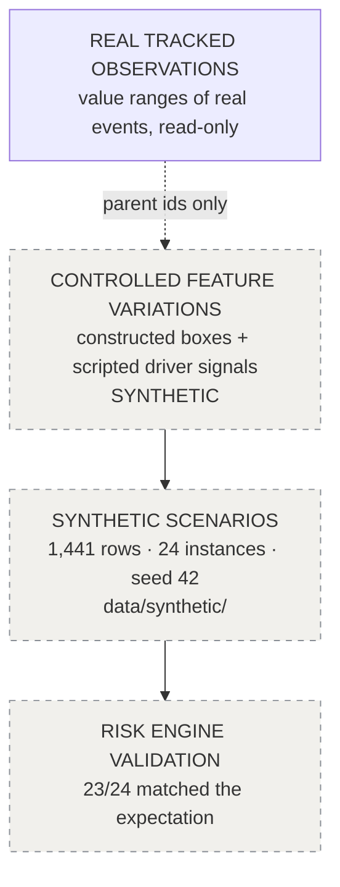

# Data lineage

## Real

## Synthetic (separate)

## Labels at each step

| Step | Label |
| --- | --- |
| Raw recording | `data_source = LOCAL_REAL` on every derived row |
| Per-field | `METADATA` / `OBSERVED` / `INFERRED` (real schema); `METADATA` / `SYNTHETIC_INPUT` / `ENGINE_ON_SYNTHETIC` / `VALIDATION` (synthetic schema) |
| Per-record | `observation_type`: `INFERRED` for risk/hazard events, `OBSERVED` for hand-state changes, `SYNTHETIC` for synthetic rows |
| Location | real: `gps_source = UNAVAILABLE`, coordinates null; synthetic: `gps_source = SYNTHETIC`, `location_source = SYNTHETIC_REFERENCE` |
| Storage | real and synthetic datasets are separate roots; each writer refuses the other kind |

A third, separately labelled dataset, `SYNTHETIC_COMBINATION`, was produced as a software test. It pairs a real driver clip with an unrelated real front clip, and it is not a drive. It is not included in this repository.
